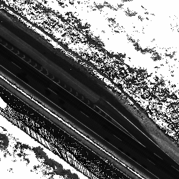
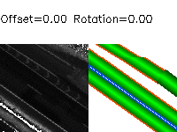
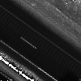
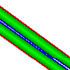
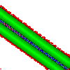
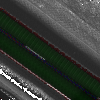

# Road Mapper Module

## Index

<!-- Table of contents generated by http://tableofcontent.eu/ -->
- [Description](#description)
- [Saving Remission Map Images](#saving-remission-map-images)
- [Splitting the Remission Map Images](#splitting-the-remission-map-images)
- [Rules for Ground Truth Annotations on Remission Map Images](#rules-for-ground-truth-annotations-on-remission-map-images)
- [Generating Road Maps from Annotated SVG Files](#generating-road-maps-from-annotated-svg-files)
- [Visualizing a Road Map](#visualizing-a-road-map)
	- [Examples](#examples)
- [Road Mapper Sampling](#road-mapper-sampling)
	- [Examples](#examples-1)
- [Training the Neural Network](#training-the-neural-network)
	- [Tutorial on How to Train and Test ENet on LCAD Road Remission dataset](#tutorial-on-how-to-train-and-test-enet-on-lcad-road-remission-dataset)
		- [Installation](#installation)
		- [Preparation](#preparation)
		- [Training ENet](#training-enet)
		- [Testing ENet](#testing-enet)
		- [Visualize the Prediction](#visualize-the-prediction)
			- [Python Code](#python-code)
			- [C++ Code](#c-code)
			- [Examples](#examples-2)
		- [Measurement of Execution Time](#measurement-of-execution-time)
- [Generating Road Maps via Inference from Remission Maps](#generating-road-maps-via-inference-from-remission-maps)

## Description

The Road Mapper module manages the *map_type* CARMEN_ROAD_MAP_v (prefix character 'r'), the data structure *road_prob* and the map server message CARMEN_MAP_SERVER_ROAD_MAP_NAME. Each cell in a road gridmap contains the following data:
```c
 typedef struct				/* Probabilities of a pixel in the road map: range(0, 0xffff) */
 {
   unsigned short off_road;		/* Probability of being off the road */
   unsigned short solid_marking;	/* Probability of being in a lane solid marking */
   unsigned short broken_marking;	/* Probability of being in a lane broken marking */
   unsigned short lane_center;		/* Probability of being at the center of a lane */
 } road_prob;
```
The following color code is used for displaying a road map:
  -  RGB(255, 255, 255) = off the road
  -  RGB(255, 000, 000) = solid marking
  -  RGB(000, 000, 255) = broken marking
  -  RGB(000, 255, 000) = center of a lane

The following class code is used for segmenting a road map:
  - 0 = off the road;
  - 1 = solid marking;
  - 2 = broken marking;
  - 3 = solid marking (50% confidence);
  - 4 = broken marking (50% confidence);
  - 5, 6, 7, ..., 20 = center of a lane confidence (100% confidence, 95%, 90%, 85%, ..., 25%), we have 16 levels of confidence, or distances from the center.

The Road Mapper module parameters can be found at [carmen-ford-escape.ini](../carmen-ford-escape.ini) and are the following:
```ini
 # Road Mapper

 road_mapper_sample_width		120	# pixels
 road_mapper_sample_height		120	# pixels
 road_mapper_distance_sample		5.0	# meters
 road_mapper_distance_offset		0.5	# meters
 road_mapper_n_offset			3	# n shifts to the left and n shifts to the right
 road_mapper_n_rotation			24	# delta = (360 degrees / n_rotation)
 road_mapper_out_path			$CARMEN_HOME/data/road_mapper  		# out path for generated sample files
 road_mapper_out_path_remission		$CARMEN_HOME/data/road_mapper_remission # out path for generated remission files
 road_mapper_image_channels		*	# road map sample image pixel may have either 1 (B&W) or 3 channels (BGR) or * for both
 road_mapper_image_class_bits		4	# road map sample image pixel class may have 0 to 6 precision bits (B&W) or 8 precision bits (BGR)
 road_mapper_remission_image_channels	3	# remission map sample image pixel may have either 1 (B&W) or 3 channels (BGR) or * for both 
```

## Saving Remission Map Images

To save the remission map images please do the following:

First step:  
In a terminal window, start the IPC central server:
```bash
 $ cd $CARMEN_HOME/bin
 $ ./central
```
Second step:  
In another terminal window, run the Process Control module using the following 
[.ini file](../../bin/process-ida_a_guarapari_playback_road_mapper_save_remission_map_images.ini) as a reference. 
Output files will be placed in the directory set by _road_mapper_out_path_remission_ parameter.
```bash
 $ cd $CARMEN_HOME/bin
 $ ./proccontrol process-ida_a_guarapari_playback_road_mapper_save_remission_map_images.ini
```

## Splitting the Remission Map Images

For convenience in ground truth annotation, the remission map images should be split in smaller parts.

First step:  
In a terminal window, create a list of the remission map image filenames:
```bash
 $ ls $CARMEN_HOME/data/road_mapper_remission/i*.png > remission_map_images.txt
```
Second step:  
Run the [image splitter utility](road_mapper_image_splitter.cpp):
```bash
 $ ./road_mapper_image_splitter 3 3 remission_map_images.txt $CARMEN_HOME/data/road_mapper_remission_350px
```
The original remission images are of 1050x1050 pixels. After splitting, each one becomes 9 images of 350x350 pixels. 
To learn more about the splitting parameters, please take a look at [road_mapper_image_splitter.cpp](road_mapper_image_splitter.cpp)

## Ground Truth Annotation in Remission Map Images

1. Open a remission map image file using [**Inkscape**](https://inkscape.org/en/download) and draw a polyline all the way along the center of each road lane.
2. Place both the start and finish points out of the image limits, in order to provide a better fit for each polyline.
3. Place the points in such a way that the lane's driving orientation matches the direction from the start point to the finish point.
4. If two polylines either cross, merge or fork, then make sure to draw the *main* polyline before the secondary. 
5. Make each point of the polyline auto-smooth, in order to turn the polyline into a cubic Bezier curve.
6. Properly set each polyline stroke width, in order to fulfill each road lane and touch the borders of the neighbor lanes.
7. Select each line stroke paint color according to the following code:
  -  RGB(255, 000, 000) = #ff0000 = single line marking on both lane sides.
  -  RGB(255, 000, 127) = #ff007f = single line marking on the right side and broken line marking on the left side.
  -  RGB(127, 000, 255) = #7f00ff = broken line marking on the right side and single line marking on the left side.
  -  RGB(000, 000, 255) = #0000ff = broken line marking on both lane sides.
  -  RGB(000, 255, 000) = #00ff00 = no line marking on both lane sides
  -  RGB(255, 127, 000) = #ff7f00 = single line marking on the right side and no line marking on the left side.
  -  RGB(127, 255, 000) = #7fff00 = no line marking on the right side and single line marking on the left side.
  -  RGB(000, 127, 255) = #007fff = broken line marking on the right side and no line marking on the left side.
  -  RGB(000, 255, 127) = #00ff7f = no line marking on the right side and broken line marking on the left side.
8. Save the annotated Inkscape SVG file keeping the same name as the remission map image file.

*R.Carneiro:	from i7726530_-353710.png to i7758030_-363790.png*  
*R.Nascimento:	from i7705530_-338310.png to i7726460_-353990.png*

## Generating Road Maps from Annotated SVG Files

To generate the road maps from the svg files, please do the following:

First step:  
Create a list of svg filenames:
```bash
 $ ls svgs/*.svg > svg_list.txt
```
Second step:  
Run the [Generate Ground Truth utility](road_mapper_generate_gt3.py).
Output files will be placed in the directory set by -o parameter
```bash
 $ python road_mapper_generate_gt3.py -f svg_list.txt -o maps -n
```
To learn more about the utility parameters please run the program with -h option:
```bash
 $ python road_mapper_generate_gt3.py -h
```

## Visualizing a Road Map

To visualize a road map please run the [Display Map utility](road_mapper_display_map3.cpp):
```bash
 $ ./road_mapper_display_map3 maps/r*.map
```
To learn more about the utility parameters please please run the program with -h option:
```bash
 $ ./road_mapper_display_map3 -h
```

### Examples

| Image Name           | Remission Map                               | Ground Truth                                   | Road Map Probabilities                     | Road Map Classes                               |
| :------------------: | :-----------------------------------------: | :--------------------------------------------: | :----------------------------------------: | :--------------------------------------------: |
| i7705600_-338380.png |  |  |  |  |
| i7726110_-353570.png |  |  |  |  |

## Road Mapper Sampling

To generate sample pairs of remission map images and road map images willing to train a neural network, please do the following:

First step:  
Start the IPC central server (if it is not running yet) [as previously said](#saving-remission-map-images).

Second step:  
In another terminal window, run the Process Control module using the following 
[.ini file](../../bin/process-ida_a_guarapari_playback_road_mapper_sampling.ini) as a reference. 
Output sample files will be placed in the directory set by _road_mapper_out_path_ parameter.
```bash
 $ cd $CARMEN_HOME/bin
 $ ./proccontrol process-ida_a_guarapari_playback_road_mapper_sampling.ini
```
**Important: Before clicking the _Play_ button in the Playback Control panel, set a reduced _Speed_ (0.3 or less).**

### Examples

| Global Position    | Samples                                       |
| :----------------: | :-------------------------------------------: |
| (7726093, -353507) |  |

<!-- gif generated by  http://gifmaker.me/ -->

## Training the Neural Network

We are using the ENet Neural Network to learn and predict the road map classes.

ENet is a semantic segmentation deep neural network that learns to predict pixel-wise class labels from supervised learning. Therefore it requires a dataset of input images with corresponding ground truth labels. Input must be three-channel images. Ground truth must be single-channel images, each pixel labeled with a class number.

For more information on ENet please refer to the published paper in arXiv: [ENet: A Deep Neural Network Architecture for Real-Time Semantic Segmentation](https://arxiv.org/abs/1606.02147).

### Tutorial on How to Train and Test ENet on LCAD Road Remission dataset

This tutorial is inspired on [Tutorial on how to train and test ENet on Cityscapes dataset](https://github.com/TimoSaemann/ENet/tree/master/Tutorial).

Please compile the carmen_lcad version of the modified Caffe framework **caffe-enet** (It supports all necessary layers for ENet):
```bash
 $ cd $CARMEN_HOME/sharedlib/ENet/caffe-enet
 $ mkdir build && cd build
 $ cmake ..
 $ make all -j 20 && make pycaffe
```

You can also consult the generic [Caffe installation guide](http://caffe.berkeleyvision.org/installation.html) for further help. If you like to compile with **make**, please uncomment the following line in the Makefile.config 
```bash
$ WITH_PYTHON_LAYER := 1 
```
	
Please make sure that the python layer (spatial_dropout.py) is defined in your PYTHONPATH:

You can do this by adding to you .bashrc file:
```bash
 export CAFFE_ENET_HOME=$HOME/ENet/caffe-enet
 export PYTHONPATH=$CAFFE_ENET_HOME/python
 export LD_LIBRARY_PATH=$CAFFE_ENET_HOME/build/lib:$LD_LIBRARY_PATH
```

Check the existence of file $CAFFE_ENET_HOME/include/caffe/proto/caffe.pb.h. If not, please do the following: 
```bash
 cd $CAFFE_ENET_HOME
 protoc src/caffe/proto/caffe.proto --cpp_out=.
 mkdir include/caffe/proto
 mv src/caffe/proto/caffe.pb.h include/caffe/proto
```

#### Preparation

After [sampling](#road-mapper-sampling) the dataset, please do the following to learn how many directories your dataset has:
```bash
 $ cd $CARMEN_HOME/src/road_mapper
 $ python road_mapper_enet_training.py ../../data/road_mapper 1000000000 1
```
The output will be:
```bash
Dataset ../../data/road_mapper contains yyyyy pose directories.
Insufficient number of poses for training and test. Please modify the arguments.
```
where yyyyy tells you how many directories of data you have.

Please do the following to randomly generate the train and test datasets, where yyyyy and zzzz are the number of directories that will be used for building your train an test datasets. You will have about 168 input-ouput pairs for each directory.
```bash
 $ python road_mapper_enet_training.py ../../data/road_mapper yyyyy zzzz
```
The files road_mapper_train.txt and road_mapper_test.txt will be generated with the trainning and test input-output pairs, respectively.

To learn more about the parameters of road_mapper_enet_training.py, please run the program with the -h option:
```bash
 $ python road_mapper_enet_training.py -h
```

Next, change **caffe_root** to the absolute path of **caffe-enet** in the following scripts:
 - ENet/scripts/BN-absorber-enet.py
 - ENet/scripts/compute_bn_statistics.py
 - ENet/scripts/create_enet_prototxt.py
 - ENet/scripts/test_segmentation.py

Furthermore, change all relative paths to the absolute path in both solver files:
 - ENet/prototxts/enet_solver_encoder.prototxt
 - ENet/prototxts/enet_solver_encoder_decoder.prototxt

#### Training ENet 

The training of ENet is performed in two stages: 
 - training the encoder architecture
 - training the encoder and decoder architecture jointly

##### Let's Start With the Encoder Training

<!--The next step is optional:-->

To improve the quality of ENet predictions for classes less represented in the dataset (solid marking, broken marking, etc.), you can add **class_weighting** to the **SoftmaxWithLoss** layer. 
```bash
 $ python ENet/scripts/calculate_class_weighting.py --source $CARMEN_HOME/src/road_mapper/road_mapper_train.txt --num_classes 22 > result.txt
```
The program ENet/scripts/calculate_class_weighting.py might complain (see the result.txt file) that there is a class missing, say, class 18 - **Exception: The class 18 is not present in the dataset**. In this case, change the parameter --num_classes 22 to --num_classes 17. Note that, in this case, you have to change the number of classes in all commands below.

Copy the **class_weightings** from the result.txt to the `enet_train_encoder.prototxt` file under **weight_by_label_freqs** and set this flag from **false** to **true**. The file is `enet_train_encoder.prototxt` generated/changed in the step below. So, after that step, copy the **class_weightings** from the result.txt to it.

Create the prototxt file `enet_train_encoder.prototxt` by running:
```bash
 $ python ENet/scripts/create_enet_prototxt.py  --source $CARMEN_HOME/src/road_mapper/road_mapper_train.txt --mode train_encoder --batch_size 20 --new_height 120 --new_width  120 --num_of_classes 17
```
To learn more about the parameters please run the program with the -h option:
```bash
 $ python create_enet_prototxt.py -h
```

The values of batch_size, new_height and new_width are limited by the available GPU memory. The batch_size must be as big as possible and fit GPU memory. The values of new_height and new_width must be divisible by 8.

The prototxt file contains the ENet encoder architecture with some default settings that you may customize according to your needs. For more information take a look at the prototxt file or in the python file.
 
Before training:

Please, have a look in the `ENet/prototxts/enet_solver_encoder.prototxt` file and change it to achieve the desired number of epochs and etc. For more details on the Caffe solver file, please have a look at [Caffe Solver Parameters](https://github.com/BVLC/caffe/wiki/Solver-Prototxt).

The number of epochs are calculated according to the following:

epochs = (max_iter * batch_size) / dataset_train_size

To calculate the max_iter solver parameter to a given number of epochs please do the following:

max_iter = (epochs * dataset_train_size) / batch_size

Now you are ready to start the training:
```bash
 $ ENet/caffe-enet/build/tools/caffe train -solver ENet/prototxts/enet_solver_encoder.prototxt
```

If the GPU memory is not enough (error == cudasuccess), reduce the batch_size in `ENet/prototxt/enet_train_encoder.prototxt` file.

##### After the Encoder-Training is Finished you can Continue with the Training of Encoder + Decoder

First create the `enet_train_encoder_decoder.prototxt` by running:
```bash
 $ python ENet/scripts/create_enet_prototxt.py  --source $CARMEN_HOME/src/road_mapper/road_mapper_train.txt --mode train_encoder_decoder --batch_size 20 --new_height 120 --new_width  120 --num_of_classes 17
```

Copy the **class_weightings** from `enet_train_encoder.prototxt` to `enet_train_encoder_decoder.prototxt` under **weight_by_label_freqs** and set this flag from **false** to **true**. 

Start the training of the encoder + decoder and use the pretrained weights as initialization of the encoder:
```bash
 $ ENet/caffe-enet/build/tools/caffe train -solver ENet/prototxts/enet_solver_encoder_decoder.prototxt -weights ENet/weights/snapshots_encoder/NAME.caffemodel
```

Replace the place holder **NAME** to the name of your weights.

#### Testing ENet

Create the prototxt file `enet_deploy.prototxt`:

First change the line 256 in `create_enet_prototxt.py` from `parser.add_argument('--input_size', nargs='*', type=list, default=[512, 1024], help='size of input image for deploy network. [h, w]')` to `parser.add_argument('--input_size', nargs='*', type=int, default=[512, 1024], help='size of input image for deploy network. [h, w]')`.

Now run:
```bash
 python ENet/scripts/create_enet_prototxt.py  --source $CARMEN_HOME/src/road_mapper/road_mapper_train.txt --mode test --input_size 120 120 --num_of_classes 17 

```

The [Batch Normalisation layers](https://arxiv.org/abs/1502.03167) in ENet shift the input feature maps according to their mean and variance statistics for each mini batch during training. At test time we must use the statistics for the entire dataset.

For this reason run **compute_bn_statistics.py** to calculate the new weights called **test_weights.caffemodel**:

First, change the line 196 in `compute_bn_statistics.py` from `in_h, in_w = (512, 1024)` to `in_h, in_w = (120, 120)`.

Now run:
```bash
 $ python ENet/scripts/compute_bn_statistics.py ENet/prototxts/enet_train_encoder_decoder.prototxt ENet/weights/snapshots_decoder/NAME.caffemodel ENet/weights/weights_bn/ 
```

The script saves the **bn-weights** in the output directory `ENet/weights/weights_bn/weights_bn.caffemodel`.

For inference, batch normalization and dropout layer can be merged into convolutional kernels, to speed up the network. You can do this by running:
```bash
 $ python ENet/scripts/BN-absorber-enet.py --model ENet/prototxts/enet_deploy.prototxt --weights ENet/weights/weights_bn/weights_bn.caffemodel --out_dir ENet/final_model_weights/
```

It also deletes the corresponding batch normalization and dropout layers from the prototxt file. The final model (prototxt file) and weights are saved in the folder **final_model_and_weights**. 

#### Visualize the Prediction 

##### Python Code

Create the colormap:

First copy the colors from [colors_to_colormap.txt](data/colors_to_colormap.txt) to `create_colormap.py` (note that the array lut1 must have 256 elements) and change line 286 in `create_colormap.py` from `cv2.imwrite('ENet/scripts/cityscapes19.png', im_color)` to `cv2.imwrite('ENet/scripts/road_mapper_17.png', im_color)`. Then:
```bash
 $ python ENet/scripts/create_colormap.py
```

Alternatively you can use [road_mapper_17.png](data/road_mapper_17.png) colormap.

Also, change line 67 in `test_segmentation.py` from `label_colours_bgr = label_colours[..., ::-1]` to `label_colours_bgr = label_colours#[..., ::-1]`.

Now, you can visualize the prediction of ENet by running:
```bash
 $ python ENet/scripts/test_segmentation.py --model ENet/final_model_weigths/bn_conv_merged_model.prototxt \
 		--weights ENet/final_model_weigths/bn_conv_merged_weights.caffemodel \
 		--colours carmen_lcad/src/road_mapper/data/road_mapper_17.png \
 		--input_image carmen_lcad/data/road_mapper/7726627_-353889/i7726627_-353889_0.50_30.00.png \
 		--out_dir ENet/example_image/
```

Or, in a single line:
```bash
 $ python ENet/scripts/test_segmentation.py --model ENet/final_model_weigths/bn_conv_merged_model.prototxt --weights ENet/final_model_weigths/bn_conv_merged_weights.caffemodel --colours carmen_lcad/src/road_mapper/data/road_mapper_17.png --input_image carmen_lcad/data/road_mapper/7726627_-353889/i7726627_-353889_0.50_30.00.png --out_dir ENet/example_image/ 
```

##### C++ Code

If you like to visualize the prediction of ENet with C++ code:

First, comment line 146 in `test_segmentation.cpp`.

Copy the `test_segmentation.cpp` file from `ENet/scripts` to `ENet/caffe-enet/examples/ENet_with_C++/`.

Now, please do the following:
```bash
 $ cd ENet/caffe-enet/build
 $ make
 $ cd examples/ENet_with_C++
```
 
And, then:
```bash
 $ ./test_segmentation.bin ~/ENet/final_model_weights/bn_conv_merged_model.prototxt \
 		~/ENet/final_model_weights/bn_conv_merged_weights.caffemodel \
 		~/carmen_lcad/data/road_mapper/7726627_-353889/i7726627_-353889_0.50_30.00.png \
 		~/ENet/scripts/road_mapper_17.png
```

Or, in a single line:
```bash
 $ ./test_segmentation.bin ~/ENet/final_model_weights/bn_conv_merged_model.prototxt ~/ENet/final_model_weights/bn_conv_merged_weights.caffemodel ~/carmen_lcad/data/road_mapper/7726627_-353889/i7726627_-353889_0.50_30.00.png ~/ENet/scripts/road_mapper_17.png
```

##### Examples

| Sample Name  | Remission Map  | Road Map Classes | ENet Output Classes | Road Map Probabilities | ENet Output Probabilities | 
| :----------: | :------------: | :--------------: | :-----------------: | :--------------------: | :-----------------------: |
| i7726369_-353704_-0.50_0.00.png |  |  |  |  |  |

| Sample Name | Road Map Overlaid with Remission Map | ENet Output Overlaid with Remission Map |
| :---------: | :----------------------------------: | :-------------------------------------: |
| i7726369_-353704_-0.50_0.00.png |  |  |

#### Measurement of Execution Time

To measure ENet execution time layer-by-layer run:
```bash
 $ ENet/caffe-enet/build/tools/caffe time -model ENet/prototxts/enet_deploy_final.prototxt -gpu 0 -iterations 100
```

**For more information look in [docs/](./docs)**

## Generating Road Maps via Inference from Remission Maps

To generate the road maps via deep learning inference from existing remission maps, please do the following:

First step:  
Save the files used in ENet training and set the following parameters in [carmen-ford-escape.ini](../carmen-ford-escape.ini):
```
 # Road Mapper

 road_mapper_sampling_stride		50  # pixels,
 road_mapper_prototxt_filename		$CARMEN_HOME/src/road_mapper/data/bn_conv_merged_model.prototxt # Caffe ENet model file
 road_mapper_caffemodel_filename	$CARMEN_HOME/src/road_mapper/data/bn_conv_merged_weights.caffemodel # Caffe ENet trained weights file
 road_mapper_label_colours_filename	$CARMEN_HOME/src/road_mapper/data/road_mapper_17.png # Caffe ENet label colours file
```
Second step:  
Start the IPC central server (if it is not running yet) [as previously said](#saving-remission-map-images).

Third step:  
In another terminal window, run the Process Control module using the following 
[.ini file](../../bin/process-ida_a_guarapari_playback_road_mapper_road_inference.ini) as a reference. 
Output files will be placed in the directory set by -m parameter of road_inference module.
```bash
 $ cd $CARMEN_HOME/bin
 $ ./proccontrol process-ida_a_guarapari_playback_road_mapper_road_inference.ini
```
**Important: Before clicking the _Play_ button in the Playback Control panel, set a reduced _Speed_ (0.3 or less).**
