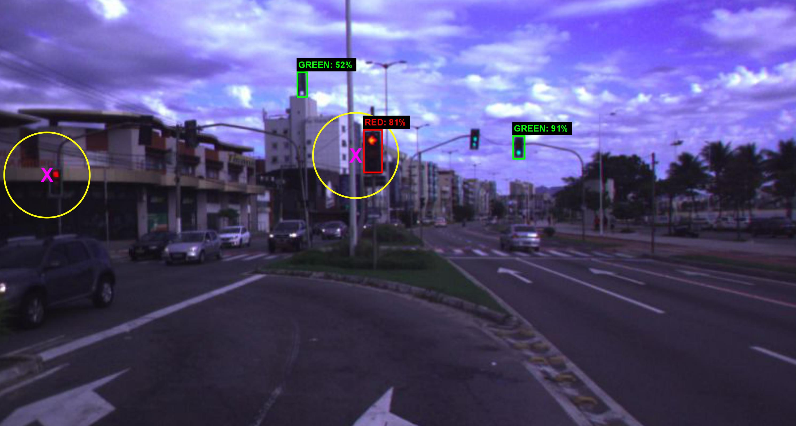
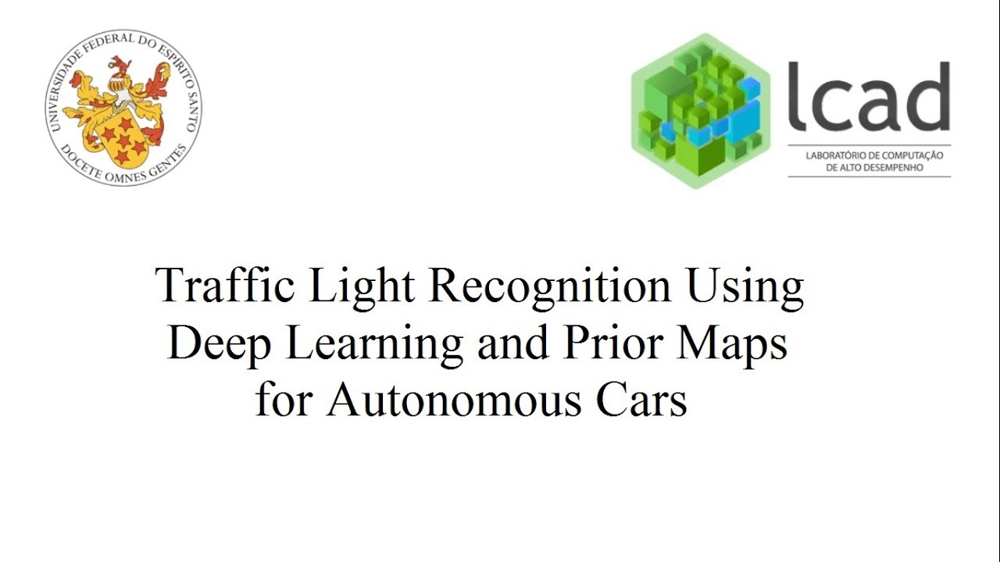

Traffic Light Recognition Using Deep Learning and Prior Maps for Autonomous Cars
================================================================================

Autonomous terrestrial vehicles must be capable
of perceiving traffic lights and recognizing their current states
to share the streets with human drivers. Most of the time,
human drivers can easily identify the relevant traffic lights. To
deal with this issue, a common solution for autonomous cars
is to integrate recognition with prior maps. However, additional
solution is required for the detection and recognition of the traffic
light. Deep learning techniques have showed great performance
and power of generalization including traffic related problems.
Motivated by the advances in deep learning, some recent works
leveraged some state-of-the-art deep detectors to locate (and
further recognize) traffic lights from 2D camera images. However,
none of them combine the power of the deep learning-based
detectors with prior maps to recognize the state of the relevant
traffic lights. Based on that, this work proposes to integrate the
power of deep learning-based detection with the prior maps used
by our car platform IARA (acronym for Intelligent Autonomous
Robotic Automobile) to recognize the relevant traffic lights of
predefined routes. The process is divided in two phases: an offline
phase for map construction and traffic lights annotation; and an
online phase for traffic light recognition and identification of the
relevant ones. The proposed system was evaluated on five test
cases (routes) in the city of Vitória, each case being composed
of a video sequence and a prior map with the relevant traffic
lights for the route. Results showed that the proposed technique
is able to correctly identify the relevant traffic light along the
trajectory.

<!-- [Link to PDF.](example.com) -->

<!--  -->

## Videos

The following video demonstrates the proposed system working offline (not in the car).

[](https://youtu.be/VhdLpuErJ8E)

## Trained Models

We trained a [YOLOv3][yolo] model using the datasets.... The trained model can be found [here][trained-model].

[yolo]: https://pjreddie.com/darknet/yolo/
[trained-model]: https://drive.google.com/drive/folders/1axWkPbXcaqc3pg-5qP-FyJMgQwnVD6d9

After compiling [darknet], run the folowing command to see the results on your own images.

[darknet]: https://github.com/pjreddie/darknet

```bash
./darknet detect [CFG].cfg [WEIGHTS].weights your_own_image.png
# Or, for multiple images:
./darknet detect [CFG].cfg [WEIGHTS].weights
```
